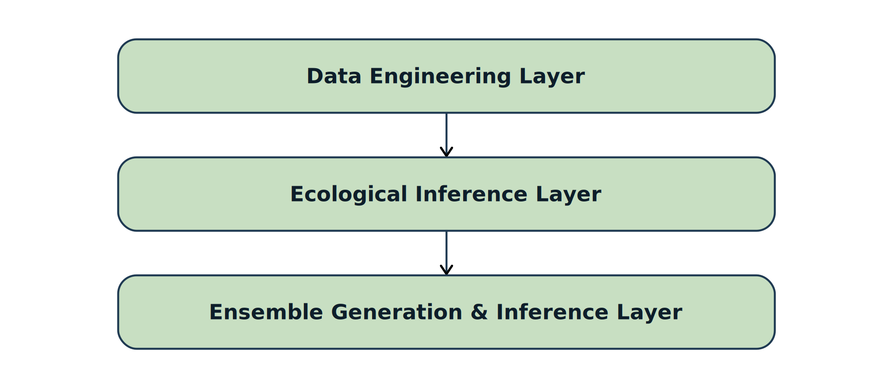

# Abstract

Section 2 of the Voting Rights Act prohibits redistricting practices that dilute the votes of a racial or ethnic minority. The evidentiary standard set by the Gingles framework requires statistical demonstration of racially polarized voting and of differential electoral opportunity across alternative plans. The components of this evidentiary chain (geospatial data preparation, ecological inference, and ensemble-based outlier analysis) have been developed extensively but largely independently of one another. A modular computational framework that integrates the three components into a single pipeline in which posterior uncertainty from the ecological-inference stage propagates through to plan-level opportunity scoring. We formalize a probabilistic notion of minority electoral opportunity, anchored in a functional that admits an axiomatic justification, and we use the Besag-Clifford parallel construction to obtain exact p-values from a Recombination Markov chain regardless of mixing time. A case study of the enacted Texas congressional plan PLANC2333 illustrates how the framework detects systematic dilution of Black and Latino voting power, with Besag-Clifford p-values at or near the resolution floor of $10^{-3}$ on every opportunity functional examined.

# 1 Introduction {#sec:intro}

## 1.1 Redistricting

Redistricting refers to the periodic redrawing of geographic boundaries that define electoral districts. Because most legislative bodies in democratic systems are comprised of elected representatives from specified constituencies, the lines that split up the districts determine which voters are grouped together, which communities share electoral representation, and which candidates and parties prevail in elections [@cain1985partisan].

## 1.2 The Redistricting Process in the United States

Article I, Section 2 of the U.S. Constitution specifies how seats are apportioned in the House of Representatives among the states [@us_const_art1_sec2]. After the decennial U.S. census and apportionment is conducted, states usually initiate their redistricting processes, during which they formulate district boundaries accounting for population changes that occurred during the past decade [@EckmanWhitaker2025MidDecade].

Although redistricting processes are mostly determined by state laws, congressional district maps are required to comply with the the U.S. Constitution and federal law [@EckmanWhitaker2025MidDecade].

Since the 1964 Wesberry v. Sanders decision, the U.S. Supreme Court has interpreted the Constitution as mandating that every congressional district possess approximately the same number of people [@EckmanWhitaker2025MidDecade]. The population totals are obtained from the U.S. Census; nowadays,all congressional districts in a state have a population difference of zero or at most one [@Duchin2023PoliticalGeometry].

Furthermore, the majority of states require that congressional districts be compact and contiguous - that is, that their districts be reasonably shaped and have all their portions be geographically connected, respectively [@Duchin2023PoliticalGeometry]. Although not all states explicitly require compactness and contiguity in their Constitutions, this is considered "standard practice" [@deford2021recombination]. The U.S. Supreme Court treats compactness and contiguity as traditional redistricting principles and diagnostic signals in racial gerrymandering analysis. For instance, in cases such as Shaw v. Reno [@Shaw1993], Miller v. Johnson [@Miller1995], and Bush v. Vera [@Bush1996], lack of compactness and contiguity were cited as evidence of race predominantly determining district lines, which is required to prove racial gerrymandering in violation of the 14th Amendment.

## 1.3 Gerrymandering {#sec:gerry}

Gerrymandering is a tactic that has been interwoven with United States politics since at least 1812, which is when the term was first coined [@sauer1992geography]. In simplest terms, gerrymandering can be defined as the manipulation of election district maps to either favor or disfavor a group of people (i.e. a political party, a racial/ethnic group, a socioeconomic class, etc).

## 1.4 Negative Racial Gerrymandering {#sec:racial-gerry}

Negative racial gerrymandering dilutes minority voting power by engineering districts in which minority ballots systematically matter less. Although minority voters retain the formal right to vote, they lack proportional influence.

Unfortunately, this practice has materialized throughout U.S. history. For instance, in response to black Americans obtaining the right to vote in 1870, Reconstruction-era Redeemer Southern Democrats wielded negative racial gerrymandering to preserve white supremacy and curtail black political power [@valelly2004two].

This distortion produces legislatures that are less representative - often whiter and more ideologically extreme than the electorate - and weakens elected officials’ incentives to respond to minority interests.

By breaking the link between voting and representation, negative racial gerrymandering undermines democratic legitimacy, erodes trust, and contributes to lower turnout and political disengagement.

## 1.5 The Legality of Negative Racial Gerrymandering {#legality}

Negative racial gerrymandering is illegal in the United States by virtue of the Equal Protection Clause of the Fourteenth Amendment and Section 2 of the Voting Rights Act.

The Equal Protection Clause of the Fourteenth Amendment forbids denying anyone of "equal protections of the law" [@USConst14].

Section 2 of the Voting Rights Act of 1965 precludes states and political entities from wielding any "standard, practice, or procedure" to curtail the voting rights of any U.S. citizen based on race [@vra1965_sec2]. In the 1986 case of Thornburg v. Gingles, it was ruled that a North Carolina redistricting plan was in violation of Section 2 of the Voting Rights Act for engaging in negative racial gerrymandering practices - more specifically, of diluting the votes of black citizens [@thornburg1986gingles]. This landmark Supreme Court case decided that minority voters can legally challenge negative racial gerrymandering practices in redistricting plans on the grounds of violating Section 2 of the Voting Rights Act, but that the burden of proof is on them to demonstrate that their capacity to elect their preferred candidates is undermined [@thornburg1986gingles].

In the Thornburg v. Gingles case, the Supreme Court established a framework for minority voters to be able to prove negative racial gerrymandering in violation of Section 2 of the Voting Rights Act in a court of law [@thornburg1986gingles]. Under this framework, plantiffs must be able to prove the following: (1) a "geographically insular" minority group makes up the majority population of a district, (2) the minority group is "politically cohesive", and (3) the "bloc voting majority" is usually able to defeat the minority group's preferred candidates [@thornburg1986gingles]. The second and third preconditions are stated by the U.S. Supreme Court as concerning "racially polarized voting" [@allen_milligan_2023].

The U.S. Supreme Court refers to this framework as "the Gingles framework" [@allen_milligan_2023]. For the last 40 years, claims of negative racial gerrymandering in violation of Section 2 of the Voting Rights Act have been assessed via the Gingles framework [@allen_milligan_2023]. In the 2023 Allen v. Milligan decision, the U.S. Supreme Court reaffirmed the validity of the Gingles framework [@allen_milligan_2023].

## 1.6 Current Mid-Decade Redistricting Efforts

Starting in 2025, a coordinated wave of mid-decade redistricting efforts has emerged. The Congressional Research Service has documented that lawmakers in California, Missouri, North Carolina, Ohio, Texas, and Utah enacted ahead of the 2026 midterm elections, with additional states actively considering following in their footsteps [@whitaker2026redistricting].

Texas initiated this mid-decade redistricting wave. Reacting to pressure from the Trump administration to expand the Republican congressional delegation, the Texas Legislature convened a special session and, following a House Democratic quorum break, enacted a map expected to add flip 5 Congressional seats from Democrat to Republican [@goodman2025texasmap]. Texas' plan faced so many accusations of negative racial gerrymandering that this escalated to the U.S. Supreme Court in LULAC v. Abbott [@lulac2025]. It should be noted, however, that when the U.S. Supreme Court issued a stay order for the case, the Texas map was permitted to be enacted into law [@lulac_stay_2025].

# 2 Related Work {#sec:related}

## 2.1 Redistricting Data Preparation {#sec:data-prep}

### 2.1.1 Constructing Racial Categories {#sec:race-cats}

In this paper, the Data and Democracy Lab's conventions for constructing demographic categories are adopted.

Their convention for categorizing racial groups involves adopting these group names in the ensuing order: Black, Hispanic, Asian, Other,and White [@mggg_vap_cvap].

It is emphasized that anyone who identifies as black should be grouped into the black population [@mggg_vap_cvap]. In other words, the black population should encompass those who are "Any-Part Black" or "Black Alone or in Combination", as opposed to just "Black Alone" or "Single-Race Black" [@mggg_vap_cvap].

Then, of the individuals left, the Hispanic population must encompass all individuals who identify as Hispanic in the same way the Black population does [@mggg_vap_cvap]. Next, of those left, the Asian population should capture all who identify as Asian or Native Hawaiian Pacific Islander, so as to represent an AAPI category [@mggg_vap_cvap]. Finally, the same logic is used to construct the AMIN, Other, and White categories [@mggg_vap_cvap].

Thereafter, the Decennial Census Redistricting PL 94-171 dataset is leveraged to generate voting age population as sums of census variables [@mggg_vap_cvap].

Subsequently, the Citizen Age Voting Population (CVAP) by Race and Ethnicity, a special tabulation from the 5-year American Community Survey, is analyzed. The problem is, CVAP data from the ACS must be analyzed at the census block level because the base unit of the Decennial Census PL 94-171 data is the census block. In the primary tables, ACS is reported at the census tract level, which presents a problem because that is a significantly higher level of aggregation than the census block [@mggg_vap_cvap].

Fortunately, the Data and Democracy Lab has introduced a solution to this problem called "discounting" [@mggg_vap_cvap]. Discounting refers to the usage of the tract-level ACS data to estimate the citizenship rates of racial groups, then applying the discount to the voting age population [@mggg_vap_cvap].

An example of "discounting" provided by the Data and Democracy Lab is depicted below; in this example, block X belongs to tract Y in state Z and BCVAP is estimated by taking the citizenship rate for the group in the tract and applying it to the voting ager population in the block [@mggg_vap_cvap]. $$\frac{BCVAP_{ACS}(tract \: Y)}{BVAP_{ACS}(tract \: Y)} \times BVAP_{PL}(block \: X) = BCVAP(block \: X)$$

If the denominator in an equation like the one above is too low, then the Data and Democracy Lab proposes a solution like the one below. This involves swapping in the citizenship rate given that the tract did not allow for a meaningful estimate [@mggg_vap_cvap].

$$\frac{BCVAP_{ACS}(state \: Z)}{BVAP_{ACS}(state \: Z)} \times BVAP_{PL}(block \: X) = BCVAP(block \: X)$$

The Data and Democracy Lab acknowledges that this is a "crude fix", but states that they intend to release a "more sophisticated" Bayesian method to address this in the future [@mggg_vap_cvap].

## 2.2 Ecological Inference {#sec:ei}

To reiterate what is stated in Section 1.5, in order to prove a violation of $\S2$ of the Voting Rights Act under the Gingles framework,plaintiffs must prove that the majority votes as a bloc to defeat minority-preferred candidates [@thornburg1986gingles]. Hence, any framework performing $\S2$ Voting Rights Act analysis must encompass identification of minority-preferred political candidates [@BeckerDuchinGoldHirsch2021].

In state election return datasets, vote totals for political candidates are not computed by race, meaning that direct computation of minority-preferred candidates is impossible [@BeckerDuchinGoldHirsch2021]. This is where ecological inference - the de-facto solution for determining racially polarized voting - comes in. After all, ecological inference is widely regarded as "the best and often only hope of making progress" when it comes to extracting clues about individual behavior from group or aggregate-level data [@king2004ecological].

Ecological inference (and ecological regression, its simpler predecessor) is considered a "statistical mainstay" in $\S2$ Voting Rights Act litigation [@freedman1999ecological]. U.S. Supreme Court redistricting cases in which lower-court findings relying on ecological inference were reviewed and accepted without methodological objection include Allen v. Milligan [@allen_milligan_2023], Alexander v. State Carolina State Conference of the NAACP [@alexander2024], Cooper v. Harris [@cooper2017], Bethune-Hill v. Virginia State Board of Elections [@bethunehill2017], and Abbott v. Perez [@abbott2018].

It should be noted, however, that in the same way all statistical inference techniques with missing data give way to uncertainty, ecological inference produces "imperfect" and "uncertain" answers [@BeckerDuchinGoldHirsch2021]. Hence, it is essential to estimate the error produced by ecological inference techniques and observe how it compounds or cancels out in high-level conclusions [@BeckerDuchinGoldHirsch2021].So, in addition to identifying the minority-preferred candidates, one must specify the confidence measures that the identifications are correct [@BeckerDuchinGoldHirsch2021]. To check for minority control of a district and identify preferred candidates for newly proposed districts, the statewide and precinct-level vote estimates by race should be leveraged [@BeckerDuchinGoldHirsch2021].

Becker et al. [@BeckerDuchinGoldHirsch2021] implement a version of King's ecological inference, specifically the `ei.mD.bayes` function from eiPack which is based on the Bayesian hierarchical Dirichlet model for $R \times C$ tables proposed by King et al. in 1999 [@king1999binomial_beta_ei].

For each election, EI is run at the statewide level using precinct-level input tables [@BeckerDuchinGoldHirsch2021]. The inputs for each precinct are the row and column sums for the $R \times C$ table of vote counts. The row sums correspond to the precinct's estimated number of adult citizens in each racial group. The column sums are the precinct's vote totals for each candidate [@BeckerDuchinGoldHirsch2021].

Each ecological inference run generates a large random sample of estimated vote counts; in order to obtain the statewide estimates, these values are summed across the entire state [@BeckerDuchinGoldHirsch2021]. For each racial group, the candidate with the highest average estimated vote total for an election is the preferred candidate [@BeckerDuchinGoldHirsch2021]. In order to obtain a measure of confidence for the a candidate was correctly identified as the preferred candidate, repeated draws for the ecological inference distribution are obtained and the frequency by which the preferred candidate receives the most votes is recorded [@BeckerDuchinGoldHirsch2021].

## 2.3 Ensemble-Based Outlier Analysis in Redistricting {#sec:ensemble-related}

Recent methods for analyzing and comparing district plans attempt to do so by placing a plan in the context of valid alternatives - that is, those that cut up the same jurisdiction by the same rules and with the structural features of the geography and the pattern of voting held constant [@deford2021recombination]. These ensembles contain samples from the full space of plans, aiming to help compare a plan's properties to the range of possible designs [@deford2021recombination].

In one powerful application, ensembles have been used to conduct outlier analysis, or to argue that a proposed plan has properties that are extreme relative to the comparison statistics of alternative plans [@deford2021recombination]. Arguments like this have featured in a string of recent legal challenges to gerrymanders, all of which were successful at the district court or Supreme Court level [@deford2021recombination]. Outliers have also recieved significant attention from the U.S. Supreme Court (culminating in Rucho v. Common Cause [@rucho2019]) [@deford2021recombination]. Today, ensemble-based outlier analysis is considered the dominant empirical tool to evaluate gerrymandering claims in court.

The way ensemble-based outlier analysis works is that an enacted district plan $\pi_0$ is compared against a large sample of alternative plans from a neutral baseline distribution. The relative position of $\pi_0$ within the ensemble is offered as evidence of atypicality. This methodology was introduced by redistricting expert Jowei Chen in the mid-2010s [@chen_rodden_2013].

### 2.3.1 Recombination Markov Chains {#sec:recom}

Early implementations of ensemble-based outlier analysis leveraged flip-based Markov chains [@deford2021recombination]. However, these were discovered to be problematic for several reasons.

In 2021, Daryl DeFord, Moon Duchin, and Justin Solomon set forth recombination (ReCom), a novel family of Markov chains intended for the ensemble generation of alternative redistricting plans [@deford2021recombination]. Recombination is widely considered to be the standard engine for district plan ensemble generation in the redistricting space [@BeckerDuchinGoldHirsch2021].

Recombination chains are considered to be superior to flip chains because they produce more compact districts, whereas flip chains are said to produce "winding, fractal-like districts" [@deford2021recombination]. Also, Recom performs much faster than flip becuase flip can only change the assignment label of a few nodes at a time [@deford2021recombination].

The way a Markov chain works is it proposes whole-district swaps via uniform spanning tree bipartitions of merged adjacent districts [@deford2021recombination].

### 2.3.2 The Mixing-Time Problem {#sec:mixing}

Ensemble-based inference tests rely on the premise that the Markov chain has run long enough for the sampled plans to be approximately representative of the target distribution. The validity of any p-value derived from a single long chain depends on this premise holding. Existing work defends the premise to convergence diagnostics - running multiple chains from different starting points, comparing summary statistics across chains, and monitoring autocorrelation in test statistics over chain length.These diagnostics are necessary but not sufficient because they cannot certify convergence and they offer no formal bound on the bias they fail to detect.

The underlying difficulty is that the mixing time of ReCom on real-world precinct graphs remains unknown, and it is not known to be polynomial in any rigorous sense. Cannon et al. establish that although the spanning tree distribution targeted by ReCom is well-defined and the kernel approximately converges to it, there exists a residual gap between the measures of the uniform spanning tree approximation actually implemented and the exact spanning tree [@cannon2022voting].They also state that polynomial mixing remains conjectural even on well-behaved graphs [@cannon2022voting]. Likewise, Daryl DeFord, Moon Duchin, and Justin Solomon characterize convergence on practical graphs as an empirical question rather than a settled theoretical result [@deford2021recombination].

Hence, every ensemble-based p-value reported in redistricting literature is only valid if the chain has mixed. In Rucho v. Common Cause, ensemble-based outlier analysis was called into question since the underlying chain's convergence properties are not formally established [@rucho2019].

### 2.3.3 Approaches to the Mixing Time Problem

Three responses to the mixing problem has appeared in literature.

The most dominant approach in applied work is more compute - that is, longer chains, more starting points, and more elaborate diagnostics. However, this is not a true solution because the result is still not valid unless the chain is mixed and no amount of empirical convergence diagnostic can rule out a slow-mixing pathology that the diagnostic is not designed to detect.

Cannon et al. introduced the second approach: short bursts [@cannon2022voting].Short bursts sacrifice ensemble representativeness to optimize over plans satisfying particular criteria [@cannon2022voting].Although short bursts are excellent for detecting extreme plans, they are not intended for inferential testing of an enacted plan against a neutral baseline [@cannon2022voting].

The third approach to address this problem is to leverage an inferential framework that does not require mixing at all. In 1989, Julian Besag and Peter Clifford introduced two such frameworks for generalized Monte Carlo significance tests [@besag1989generalized]. The first is the serial method, where the test statistic's null distribution is conducted from a single chain via time-reversal arguments [@besag1989generalized]. The second method and the one adopted in this paper is the parallel method, where independent chains launched from a common state produce an exchangeable ensemble whose ranks are exactly uniform on the null [@besag1989generalized]. Neither of the two methods require the chain(s) to have mixed; the only requirement is reversibility of the kernel with respect to the target measure [@besag1989generalized]. Julian Besag and Peter Clifford's methods are well-established in spatial statistics, ecology, and image analysis, but have not been applied to redistricting ensembles.

### 2.3.4 Quantifying Minority Opportunity

The most influential framework for quantifying minority was introduced by Becker et al. in 2021 [@BeckerDuchinGoldHirsch2021]. This approach combines ecological inference to estimate each racial group's candidate preferences, recency-weighted aggregation cycles across elections to smooth idiosyncratic single-election noise, and confidence weighted aggregation that downweights elections with diffused rather than polarized preferences [@BeckerDuchinGoldHirsch2021]. The output is a district-level "effectiveness score" $s_{d}^{g} \in [0,1]$ which measures the weighted share of recent elections in which a racial group $g$'s preferred candidate won [@BeckerDuchinGoldHircsh2021].

This "effectiveness score" is then thresholded to count "opportunity districts" [@BeckerDuchinGoldHirsch2021]. For example, a district is considered to be "Latino effective" if $S^{L}_{D}$ exceeds a cutoff (typically 0.5 or 0.6), and the count of the districts is the plan's opportunity score [@BeckerDuchinGoldHirsch2021]. This thresholding step is the pressure point of existing literature. There are two major issues with this. The first is that the threshold is theoretically arbitrary; in other words, there is no principled reason to choose 0.5 over 0.6 or vice versa. The second issue is that the threshold is fragile near the cutoff point. For example, a district with $s^{d}_{g}=0.59$ counts for nothing while a district with $s^{d}_{g}=0.61$ counts in full, even though these two districts are almost identical electorally. This fragility is especially evident in situations when the effectiveness scores cluster near the cutoff.

The natural alternative introduced in each paper is to stop thresholding altogether and allowing the per-district win probability $p_{d}^{g}$ enter the plan-level function directly: $O_{g}(\pi) = \sum_{d} p_{d}^{g} (\pi)$, the expected number of districts where racial group $g$'s preferred candidate won. This functional has been informally suggested in the literature, but it has not been adopted as the basis for a formal inferential test.

# 3 Contribution

The components surveyed in Section 2 (that is, the redistricting data preparation, $R \times C$ ecological inference, and ensemble generation) exist as separately developed and well-documented tools. However, there is currently no published framework that integrates the three into one pipeline where posterior uncertainty from ecological inference propagates through to plan-level opportunity scoring and to the inferential test against an enacted plan. This paper supplies that integration. There are four specific contributions this paper offer.

## 3.1 A Unified, Modular Pipeline

An end-to-end pipeline is introduced that takes raw publicly available data sources (Decennial Census PL 94-171 Redistricting Data, ACS CVAP tabulations, state election returns, TIGER/LINE geographies) and produces a calibrated probability of minority electoral opportunity for every district in every plan. Modular in this context refers to the fact that each layer can be swapped out independently. For instance, improvements in the ecological inference layer do not require redoing the data engineering and ensemble generation & inference layer.

## 3.2 Uncertainty Propagation Rather Than Point Estimates

The ecological inference stage exports per-precinct, per-group, per-candidate octile quantiles of the posterior count distribution, and the ensemble stage Monte Carlo samples within those octile bins when scoring each candidate plan.The plan-level opportunity score therefore not only reflects variability among plans but also variability of voter-behavior in each plan. In contrast, in common practice, point estimates from ecological inference are passed downstream as if they were measured quantities.

## 3.3 A Probabilistic Notion of Minoirty Opportunity

The opportunity functional $O_{g} = \sum_{d} p_{d}^{g} (\pi)$ satisfies anonymity, district-additivity, monotonicity, and normalization.

## 3.4 Exact Inference Under Unknown Mixing Time

The mixing time problem associated with Recombination is sidestepped altogether via the Besag-Clifford parallel construction, which yields exact p-values regardless of how thoroughly the chain has mixed. Hence, \$\S\$2 Voting Rights Act analysis will no longer depend on unverifiable convergence claims and does this without modifying the recombination kernel itself.

# 4 The Framework {#sec:framework}

The framework, as demonstrated in Figure 1 below, consists of three sequential layers: data engineering layer, ecological inference layer, and the ensemble generation & inference layer.



## 4.1 Data Engineering Layer {#sec:data-layer}

### 4.1.1 Data Sources {#datasources}

The data engineering layer ingests the following raw inputs:

1.  State District Plan Shapefile
2.  Decennial Census PL 94-171 Redistricting Dataset
3.  Citizen Voting Age Population by Race and Ethnicity in a Special Tabulation from the ACS 5-Year Estimates 4. State Census Blocks Shapefile (TIGER/LINE)
4.  State Voting Tabulation District Shapefile
5.  State VTDs Election Data

### 4.1.2 Data Engineering Layer Overview

Figure 1 depicts the pipeline through which these raw data inputs are combined. The ingestion stage standardizes formats and projections. Construction of demographic categories follows the methodology outlined in Section 2.1.1. A geographic crosswalk allocates blocks to precincts by spatial intersection, after which keys are harmonized across the demographic and electoral sources, the unified dataset is assembled, and a final schema enforces derived proportion columns and consistent column names. Validation checks confirm that population sums match between sources and that no precinct is left without a district assignment.


## 4.2 Ecological Inference Layer {#sec:ei-layer}

A Bayesian multinomial--Dirichlet model is adopted:

$$\theta_{p,c} = \sum_{r=1}^{R} X_{p,r} \beta_{p,r,c},$$

$$V_p \sim \text{Multinomial}(N_p, \theta_p).$$ . Posterior samples are used to compute group preferences, district-level win probabilities, and uncertainty distributions.

The method Becker et al. leverage to record precinct-level probabilistic information in a condensed form is adopted here [@BeckerDuchinGoldHirsch2021].This method allows distributions to be recorded at every step of the Markov chain and involves compressing a histogram into octiles, storing only eight "bars" as opposed to "dozens of hundreds" [@BeckerDuchinGoldHirsch2021].

The post-EI processing stage builds the calibration data, scores the enacted plan against labeled outcomes, and fits per-(mode, subgroup) logistic nideks tgat nao ecological inference output into district-level win probabilities.


## 4.3 Ensemble Generation & Inference Layer {#sec:ensemble-layer}

### 4.3.1 Setup and Notation {#sec:ensemble-setup}

The notation of Daryl DeFord, Moon Duchin, and Justin Solomon's foundational Recombination Markov chain paper is adopted here. A graph $G = (V,E)$ is constructed where $V$ is a set of vertices for each geographic unit (precincts, in this case) and $E$ is a set of edges between those geographic units that are geographically adjacent [@deford2021recombination]. Hence, a redistricting plan is a partition of the nodes of V into subsets that induce connected components of G [@deford2021recombination]. In this manner, redistricting can be reframed as a graph partitioning problem [@deford2021recombination]. Equivalently, a redistricting plan is an assignment of each node to one of $k$ districts via a labeling map $V \to \{1, \cdots, k\}$ [@deford2021recombination].

So, to restate the above, $V = \{v_1, \ldots, v_K\}$ denotes the precincts in the state, with rook-adjacency graph $G = (V, E)$. Let $\pi$ be a redistricting plan be a partition $V \to {1, \cdots, K}$ of $K$ districts. Let the enacted redistricting plan being analyzed be denoted as $\pi_0$.

In dual graphs derived from real-world data, nodes are weighted with populations or demographic data, which is represented with functions $w: V \to R$ [@deford2021recombination]. This notation enables the efficient expression of constraints [@deford2021recombination]. Let $\epsilon$ be a small population deviation greater than zero [@cannon2022spanning].

A condition that bounds population deviation can be modeled as $$(1-\epsilon)\frac{\sum_{V}w(v)}{k} \leq |V_{i}| \leq (1 + \epsilon) \frac{\sum_{V}w(v)}{k}$$ [@deford2021recombination].

Let $\Pi_{k}(\epsilon)$ denote the set of redistricting plan where every district induces a connected subgraph and the population balance condition holds for every district $d$.

Let $\rho$ denote the spanning-tree measure on $\Pi_{k}(\varepsilon)$,

$$\rho(\pi) \;\propto\; \prod_{d=1}^{K} \tau\bigl(G[\pi^{-1}(d)]\bigr),$$ where $\tau(H)$ is the number of spanning trees of subgraph $H$ [@cannon2025sampling].

The hypothesis we test is $$H_0 : \pi_0 \sim \rho_{\mathcal{C}},$$ where $\rho_{\mathcal{C}}$ is $\rho$ restricted to a constraint subset $\mathcal{C} \subseteq \Pi_{k}(\epsilon)$ encoding compactness and county-respect requirements [@deford2021recombination]. The test statistics are scalar functionals $T : \Pi_{k}(\varepsilon) \to \mathbb{R}$ measuring minority opportunity.

Despite strong empirical performance, the mixing time of ReCom Markov chains on realistic precinct graphs is not theoretically characterized [@cannon2022voting]. As with many high-dimensional combinatorial Markov Chain Monte Carlo methods, polynomial mixing is conjectured but not proven [@levin2009markov], and convergence rates may be slow in practice. We sidestep this concern by adopting the inference procedure described below; upon leveraging this procedure, validity holds exactly regardless of mixing.

### 4.3.2 The Minority Opportunity Functional {#sec:opportunity}

For each protected minority group $g$, each plan $\pi$, and each district $d$, let $p_d^g(\pi) \in [0, 1]$ denote the model-based probability that group $g$'s preferred candidate wins in district $d$.

The probabilities $\{p_d^g(\pi)\}$ are produced by the scoring layer within the ecological inference layer, which combines a $R \times C$ ecological-inference model of group-specific candidate preferences with recency-weighted election histories under three weighting schemes (statewide, equal, and district). The opportunity functional is defined as the sum of district-level win probabilities, as demonstrated below.

$$O_g(\pi) \;=\; \sum_{d=1}^{K} p_d^g(\pi),$$

A coalition functional $O_{\mathrm{joint}}(\pi)$ (depicted below) which combines Black $B$ and Latino $L$ voters into a coalition cred eachits district to whichever group has the higher win probability.

$$O_{\mathrm{joint}}(\pi) \;=\; \sum_{d=1}^{K} \max\!\bigl\{p_d^B(\pi),\, p_d^L(\pi)\bigr\}.$$

Let $\bar{m}_{g}$ denote the statewide CVAP share of group $g$ and define the diversity-calibrated minority opportunity functional as

$$F_g(\pi) \;=\; O_g(\pi) - K\,\bar{m}_g$$

. Note that $F_g$ is a translation of $O_g$ that centers the demographic baseline at zero. If $F_g(\pi) < 0$, this is an indicator of minority opportunity being below proportionality.

We adopt $F_g$ as the primary test statistic, and report $O_g$ and the ensemble-standardized $$Z_g(\pi) \;=\; \bigl(O_g(\pi) - \mathbb{E}_{\rho_{\mathcal{C}}}[O_g]\bigr) \big/ \sqrt{\mathrm{Var}_{\rho_{\mathcal{C}}}(O_g)}$$ as auxiliary quantities, with $\mathbb{E}_{\rho_{\mathcal{C}}}$ and $\mathrm{Var}_{\rho_{\mathcal{C}}}$ estimated from the spoke ensemble of §4.4.

### 4.3.3 Axiomatic Justification of the Minority Opportunity Functional

We seek a single number $T(\pi)$ summarizing how much electoral opportunity plan $\pi$ extends to group $g$. We start from one structural assumption and impose five substantive axioms, then show that together they single out $O_g$ uniquely.

**Structural assumption.** $T(\pi)$ depends on the plan only through the vector of district-level win probabilities,

$$\mathbf{p}(\pi) \;=\; \bigl(p^g_1(\pi),\, p^g_2(\pi),\, \ldots,\, p^g_K(\pi)\bigr) \;\in\; [0,1]^K.$$

That is, two plans with the same win-probability vector receive the same opportunity score. We may therefore write $T(\pi) = f(\mathbf{p}(\pi))$ for some function $f : [0,1]^K \to \mathbb{R}$. The structural assumption is reasonable because the win probabilities $p^g_d(\pi)$ already encode the demographic and electoral structure of each district — they are the output of the ecological-inference layer applied to that structure — so adding demographic data as a separate input to $T$ would double-count.

The five axioms then constrain $f$:

|   | Axiom | Statement | Intuition |
|------------------|------------------|------------------|------------------|
| **A1** | Symmetry | $f$ is invariant under permutations of its arguments. | District labels carry no information; only the multiset of probabilities matters. |
| **A2** | District Additivity | $f(p_1,\ldots,p_K) = \sum_{d=1}^{K} \phi_d(p_d)$ for some $\phi_d : [0,1] \to \mathbb{R}$. | A district's contribution does not depend on what happens in other districts. |
| **A3** | Monotonicity | If $p_d \leq p'_d$ for all $d$, then $f(\mathbf{p}) \leq f(\mathbf{p}')$. | Higher win probabilities cannot decrease minority opportunity. |
| **A4** | Normalization | $f(\mathbf{0}) = 0$ and $f(\mathbf{1}) = K$. | A plan that wins nowhere scores $0$; a plan that wins everywhere scores $K$. |
| **A5** | Expected-Count Interpretation | If district outcomes are independent Bernoulli$(p_d)$, then $f(\mathbf{p})$ equals the expected number of districts in which group $g$'s preferred candidate wins. | $T(\pi)$ is interpretable as a probabilistic count of opportunity districts. |

**Theorem.** *A function* $f : [0,1]^K \to \mathbb{R}$ satisfies A1–A5 if and only if

$$f(p_1, \ldots, p_K) \;=\; \sum_{d=1}^{K} p_d.$$

*Proof.*

The sum $\sum_d p_d$ is plainly symmetric, additive across coordinates, weakly increasing in each $p_d$, evaluates to $0$ at $\mathbf{p} = \mathbf{0}$ and to $K$ at $\mathbf{p} = \mathbf{1}$, and equals $\mathbb{E}\!\left[\sum_d X_d\right]$ when $X_d \sim \mathrm{Bernoulli}(p_d)$ independently. So A1–A5 all hold.

For the converse, suppose $f$ satisfies A1–A5.

- **A2** gives $f(\mathbf{p}) = \sum_d \phi_d(p_d)$ for some component functions $\phi_1, \ldots, \phi_K$.
- **A1** then forces $\phi_1 = \phi_2 = \cdots = \phi_K$. Call this common function $\phi$, so $f(\mathbf{p}) = \sum_d \phi(p_d)$.
- **A4** at $\mathbf{p} = \mathbf{0}$ gives $K\phi(0) = 0$, hence $\phi(0) = 0$; at $\mathbf{p} = \mathbf{1}$, $K\phi(1) = K$, hence $\phi(1) = 1$.
- **A3** forces $\phi$ to be weakly increasing.
- **A5** says $\sum_d \phi(p_d) = \sum_d p_d$ for every $\mathbf{p} \in [0,1]^K$. Setting $\mathbf{p} = (p, 0, \ldots, 0)$ and using $\phi(0) = 0$ gives $\phi(p) = p$ for every $p \in [0,1]$. Hence $f(\mathbf{p}) = \sum_d p_d$. $\blacksquare$

Each axiom does identifiable work: A2 establishes the additive-across-districts structure; A1 collapses the $K$ component functions into a single $\phi$; A3 and A4 constrain $\phi$ to be a weakly increasing map sending $0 \mapsto 0$ and $1 \mapsto 1$; A5 selects the identity $\phi(p) = p$. Dropping A5 alone leaves the family of monotone reweightings $\sum_d \phi(p^g_d)$ that effectiveness-score frameworks such as Becker et al. [2021] implicitly inhabit; our framework specializes to the cleanest case in that family.

### 4.3.4 The Neutral Ensemble: ReCom with Legal Constraints {#sec:neutral-ensemble}

The constraint set $\mathcal{C}$ includes compactness, population balance, and county-splitting prevention.

#### 4.3.4.1 Contiguity

Note that although a hard contiguity constraint was not added to the pipeline, ReCom's spanning tree mechanism guarantees that every accepted proposal is contiguous by construction [@deford2021recombination].

#### 4.3.4.2 Compactness

A "mathematically natural manner" for handling compactness is a discrete model is counting the number of cut edges in a district plan; note that cut edges refer to the number of edges in the the dual graph whose endpoints belong to different districts [@deford2021recombination]. This is intended to provide a discrete perimeter of the plan, as it corresponds well to informal visual standards of common district shapes [@deford2021recombination].

Let $\mathrm{CE}(\pi) = |\{e \in E : \pi(u) \neq \pi(w)\ \text{for}\ e=\{u,w\}\}|$ represent the number of total cut edges in the district plan [@deford2021recombination] where $$\mathrm{CE}(\pi) \;\leq\; s_c \cdot \mathrm{CE}(\pi_0), \qquad s_c = 1.5.$$ must be satisfied.$s_{c}$ refers to the slack of the compactness.

#### 4.3.4.3 County-Splitting Prevention

Furthermore, let $\mathrm{CS}(\pi)$ denote the number of counties whose precincts span two or more districts.

$$\mathrm{CS}(\pi) \;\leq\; s_g \cdot \mathrm{CS}(\pi_0), \qquad s_g = 1.2.$$

is imposed. The slack $s_{g}$ is set to preserve the county-splitting constraint while still admitting for sufficient mobility for the chain to mix.

Both thresholds are scaled to $\pi_0$ rather than imposed in absolute terms, rendering $\mathcal{C}$ state-relative: the null distribution we compare $\pi_0$ against consists of plans that are no less compact and no more county-splitting than $\pi_0$ itself, scaled by the slacks.

### 4.4 Besag-Clifford Exact Inference {#sec:bc}

Conventional ReCom analyses report tail-rank statistics from a single long chain and rely on convergence diagnostics to defend their validity [@deford2021recombination].

Here, the parallel method introduced by Besag and Clifford[@besag1989generalized] - also referred to as "the hub-and-spoke sampler" [@barber2022cosufficient] - is adopted and yields exact $p$-values under $H_0$ regardless of the kernel's mixing time.

Let $K(\cdot, \cdot)$ denote a Markov kernel that is reversible with respect to the target measure $\rho_C$. The parallel construction proceeds as follows:
 
1. **Reverse walk to a hub.** Starting from the data point $\pi_0$, run the chain backward (equivalently, forward, by reversibility) for $k$ steps to reach a *hub state* $X^*$.
2. **Forward walks to spokes.** From the hub $X^*$, run $M$ independent forward chains for $k$ steps each, producing *spokes* $Y^{(1)}, Y^{(2)}, \ldots, Y^{(M)}$.
Under reversibility of the kernel and $H_0 : \pi_0 \sim \rho_C$, the collection
 
$$
\bigl(\pi_0,\, Y^{(1)},\, Y^{(2)},\, \ldots,\, Y^{(M)}\bigr)
$$
 
is **exchangeable**. Consequently, the rank of any test statistic $T$ evaluated on $\pi_0$ within this collection is uniformly distributed on $\{1, 2, \ldots, M+1\}$ under the null.
 
For a one-sided test in which small values of $T$ constitute evidence against $H_0$ (the relevant direction for $T = F_g$, where dilution corresponds to small values), the exact p-value is
 
$$
p \;=\; \frac{\bigl|\{\,j : T(Y^{(j)}) \leq T(\pi_0)\,\}\bigr| + 1}{M + 1}.
$$
 
The minimum achievable p-value, attained when $T(\pi_0)$ is strictly less than $T$ on every spoke, is $1/(M+1)$. With $M = 1000$, this resolution floor is $\approx 10^{-3}$.
 
This procedure requires only reversibility of the kernel with respect to $\rho_C$; it does *not* require the chain to have mixed.
 

# 5 Case Study: Texas Congressional Districts {#sec:case-study}

## 5.1 Data Engineering Layer Implementation {#sec:case-data}

1.  Texas PLANC2333 District Plan Shapefile [@texasleg2025planc2333]
2.  Decennial Census PL 94-171 Redistricting Dataset
3.  Citizen Voting Age Population by Race and Ethnicity in a Special Tabulation from the ACS 5-Year Estimates
4.  Texas Census Blocks Shapefile (TIGER/LINE)
5.  Texas Voting Tabulation District Shapefile
6.  State VTDs Election Data

Table 1 below summarizes the resulting statewide demographic shares.

```{r tx-demographics, echo=FALSE}
knitr::kable(
  data.frame(
    `Racial Group` = c("Hispanic", "Black", "White", "Asian", "American Indian"),
    `Total Population` = c("34.7%", "13.5%", "46.2%", "5.0%", "0.7%"),
    `VAP` = c("35.6%", "13.0%", "43.2%", "6.1%", "1.3%"),
    `CVAP` = c("32.6%", "12.9%", "48.9%", "4.8%", "0.7%"),
    check.names = FALSE
  ),
  caption = "Texas demographics by racial group across population, voting-age population, and citizen voting-age population."
)
```

As shown in Table 2 below, the election inventory comprises six 2024 statewide contests.

Although our modeling concern is with districted elections for Congress and state elections, the analysis here is based primary on statewide contests. This is because the choices facing voters in districted elections vary across the state: in any given election year, some districts are contested,some have strong incumbents or other idiosyncraies. It ia not clear how votes for one candidate would translate to votes for a different candidate. By contrast, statewide elections allow us to make apples-to-apples comparisons across different parts of the state, since the same set of candidates competed everywhere.Ideally, we would include data for the past ten years, but this is not always possible because of data availability and precinct instability.

```{r tx-elections, echo=FALSE}
knitr::kable(
  data.frame(
    Office = c("President", "President", "U.S. Senate", "U.S. Senate",
               "Railroad Commissioner", "Railroad Commissioner"),
    Stage = c("General", "Primary", "General", "Primary", "General", "Primary"),
    Year = rep(2024, 6)
  ),
  caption = "Texas statewide elections used in the case study."
)
```

## 5.2 Ecological Inference Layer Implementation {#sec:case-ei}

Figure 3 summarizes posterior support estimates for the three Democratic statewide nominees by racial group across the general elections. The posteriors recover sharp polarization. The roughly 70-point gap between Black and White support, and the roughly 50-point gap between Hispanic and White support, and comfortably above the polarization thresholds conventionally treated as evidence of racially polarized voting under the second and third Gingles preconditions.

```{r ei-supports, fig.cap="Highest and lowest EI point estimates for each racial group's support of the 3 Democratic nominees in statewide general elections: White (19–24%), AMIN (63–74%), Hispanic (66–72%), Asian (88–90%), and Black (95–96%).", echo=FALSE}
knitr::include_graphics("figures/ei_dem_support_ranges.png")
```

## 5.3 Ensemble Generation & Statistical Comparison Layer

 


 \

# 6 Discussion

## 6.1 Limitations

This framework relies on several assumptions including approximate reversibility of the ReCom kernel, correct specification of the ecological inference model, accuracy of CVAP estimates, and representativeness of the selected elections. These limitations should be considered when interpreting results.

# 7 Conclusion

This paper introduces an exact inferential framework for redistricting analysis that eliminates reliance on Markov chain mixing assumptions. By combining Besag-Clifford inference with uncertainty-aware ecological modeling, a principled and statistically valid approach to evaluating redistricting plans is set forth.

# License

The author, Alicia Guerra, retains copyright of her work and reserves the right to submit to other journals.

# Acknowledgements

I am indebted to the SoReMo Initiative at my home institution, Illinois Institute of Technology, for funding my research. Dr. Sonja Petrović, founder of the SoReMo Initiative, has provided invaluable statistical insights. Dr. Robert Ellis, my advisor, has provided candid and thorough feedback throughout the formulation of this paper. Dr. Shahrzad (Sara) Jamshidi, my former statistical learning and Bayesian statistics professor, was instrumental in helping me get this project off the ground. And since I first started this project, my mentor, Dr. Tianxiang Lu, has been providing astute code reviews and guidance.

# References
